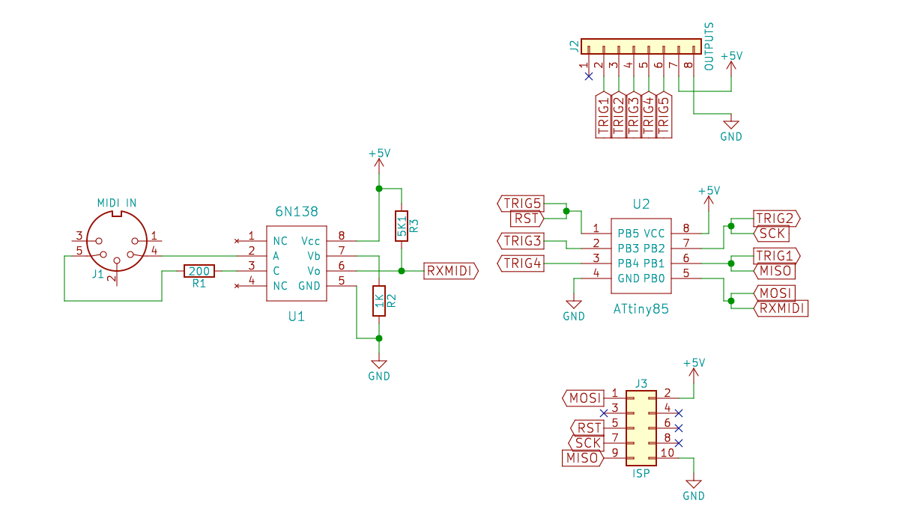

# MIDIMonkey

Listens to MIDI messages on one pin and triggers drums on the other pins (4 or 5 pins for ATtiny85).

I needed this when making analogue drums loosely following [this schematics from Delptronics](http://mickeydelp.com/blog/anatomy-of-a-drum-machine). I did not want to make a hardware sequencer, so opted to making a simple MIDI input instead.

The code is for ATtiny85, but should work on any Arduino. (For ATtiny85 you can use "Digispark (8mhz - no USB)" board in the Arduino IDE.)

## Schematics

This one is for ATtiny85 but should be easy to apply to any Arduino.

---
